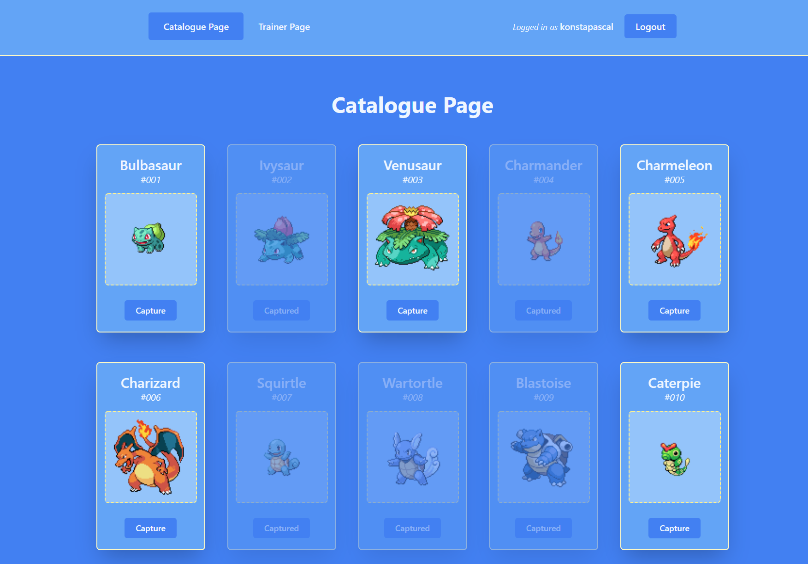
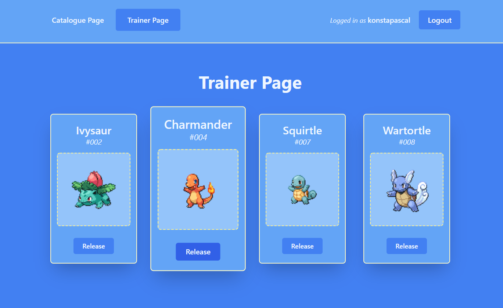
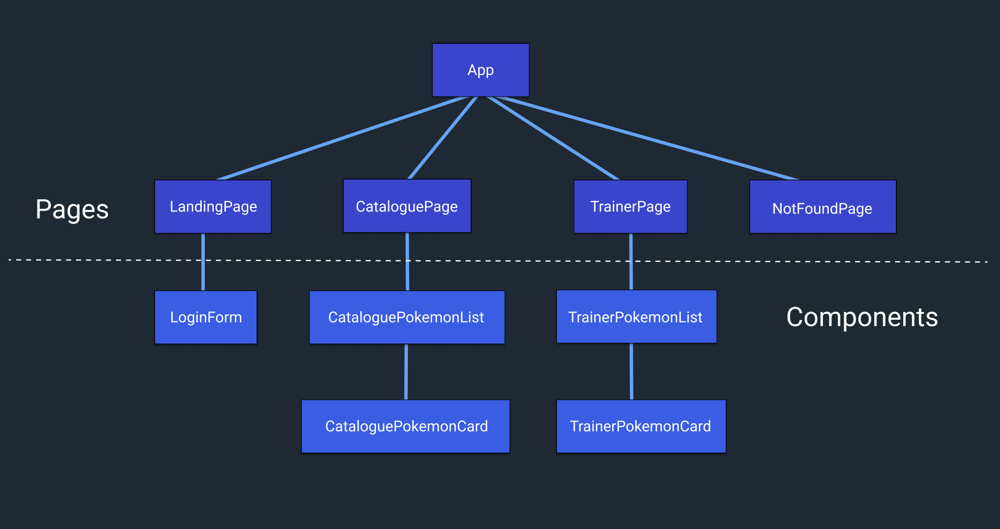

<h1 align="center">Noroff Assignment 7</h1>
<p align="center">
	
</p>

[](https://github.com/RichardLitt/standard-readme)

<a href="#" target="_blank">

</a>

Noroff assignment number 7, written by **Konstantinos Pascal** and **Michael Zaar**.

The assignment is a pokemon collector app written in **Angular** and styled with **Tailwind**. It makes use of two APIs for managing trainers and the retrieval of pokemon.

The [**JSON Server API**](https://kp-noroff-assignment-api.herokuapp.com/trainers) is hosted on Heroku and handles the creation of new users and CRUD operations on the users translations array.

## Table of Contents

- [Live Demo](#live-demo)
- [Screenshots](#screenshots)
- [Diagram](#diagram)
- [Install](#install)
- [Maintainers](#maintainers)
- [Contributing](#contributing)
- [License](#license)

## Live Demo

**https://assignment-7-angular.herokuapp.com/**

## Screenshots

<!-- <p align="center">

</p>

<p align="center">

</p>

<p align="center">

</p> -->

## Diagram

<!-- <p align="center">

</p> -->

## Install

Clone the repository using:

```
git clone https://github.com/konstapascal/noroff-assignment-7.git
```

Go inside the cloned repository:

```
cd noroff-assignment-7
```

Install Angular CLI and node module dependencies using:

```
npm i -g @angular/cli
npm install
```

Serve the web application locally using:

```
ng serve
```

## Maintainers

[@konstapascal](https://github.com/konstapascal)
[@msh-zaar](https://github.com/msh-zaar)

## Contributing

PRs accepted.

## License

MIT © 2022 Konstantinos Pascal
